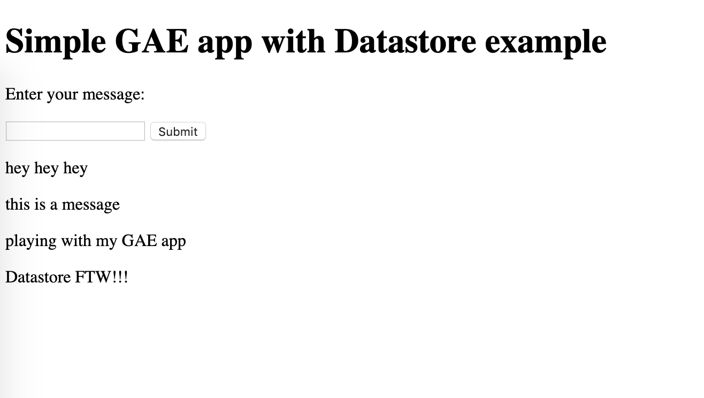
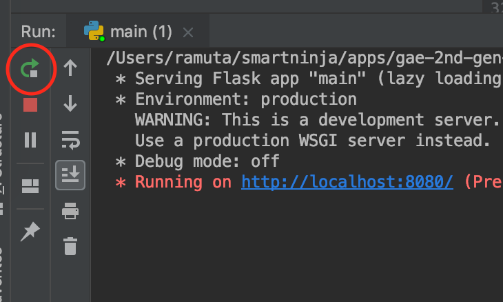

# Simple GAE app with Datastore Emulator

This is an example of a simple GAE app with a Datastore Emulator.

## Preview

## Requirements

Install the necessary libraries using this command:

    pip install -r requirements.txt

Using a virtual environment is strongly encouraged!

## Running the emulator and the web app via run.py (RECOMMENDED)

> This has only been tested on Mac so far. Not sure if it's working on Linux or Windows.

The easiest way to run the web app is via the `run.py` script. Right click it in PyCharm and select `Run 'run'`.

Alternatively, you can run it via the Terminal:

    python run.py

In this case you'll have to shut it down using CTRL+C combo.

This script also allows you to run tests (it asks you at the beginning).

## Running the emulator and web app manually (without run.py)

If the `run.py` script does not work on your computer, you'll have to run the Emulator and the web app manually.

### Run the Datastore emulator

First run the datastore emulator:

    gcloud beta emulators datastore start --no-legacy --data-dir=. --project test --host-port "localhost:8001"

Notice that the `8001` port has been used. This is for running the web app. To run tests, use port `8002`.

### Run the web app.

Next, run the web app. Right-click on `main.py` and select `Run 'main'`. Your web app will now be accessible via `localhost:8080`. Whenever 
you'll make any change in your code, make sure to **reload** the web app via this button:

To **shut down** the web app click the **red square icon** below the reload button.

Alternatively, you can run the web app via the Terminal:

    python main.py

In this case you'll have to shut it down using CTRL+C combo.

### Properly shutting down the Datastore Emulator (if not using run.py)

The easiest way to shut down the Datastore Emulator is to properly shut down the Terminal window:

If you fail to do that and your emulator is still running in the background, you'll have to locate its process and 
"kill" it via the Terminal:
    
    sudo lsof -i:8001  # finds the process running on port 8001 (emulator)
    
When you run the command written above it will give you the **ID of the process**. In order to shutdown the process run 
this:

    kill ID  # if the ID is 12345, run "kill 12345"

## Deployment to GAE

See [these instructions](https://github.com/smartninja/gae-2nd-gen-examples#deployment-to-google-app-engine).

## Issues

Please [create a new issue](https://github.com/smartninja/gae-2nd-gen-examples/issues/new) in case there's some bug or 
something should be improved.

Happy to receive pull requests, too! :)
