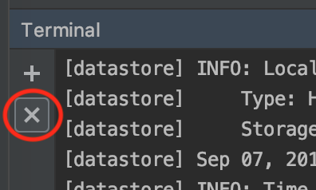

# Simple GAE app with Datastore Emulator

This is an example of a simple GAE app with a Datastore Emulator.

## Preview

## Requirements

Install the necessary libraries using this command:

    pip install -r requirements.txt

Using a virtual environment is strongly encouraged!

## Running the Datastore Emulator and the web app

### Step 1: Run the Datastore Emulator script

Open the Terminal in PyCharm, navigate to the project root (if you're not there already) and run the script:

    sh run_datastore_emulator.sh

### Step 2: Run the web app

> Assuming you use the PyCharm IDE.

Right-click on `main.py` and select `Run 'main'`. Your web app will now be accessible via `localhost:8080`. Whenever 
you'll make any change in your code, make sure to **reload** the web app via this button:

To **shut down** the web app click the **red square icon** below the reload button.

### Step 3: Shutting down the Datastore Emulator

The easiest way to shut down the Datastore Emulator is to properly shut down the Terminal window:

If you fail to do that and your emulator is still running in the background, you'll have to locate its process and 
"kill" it via the Terminal:
    
    sudo lsof -i:8001  # finds the process running on port 8001 (emulator)
    
When you run the command written above it will give you the **ID of the process**. In order to shutdown the process run 
this:

    kill ID  # if the ID is 12345, run "kill 12345"
